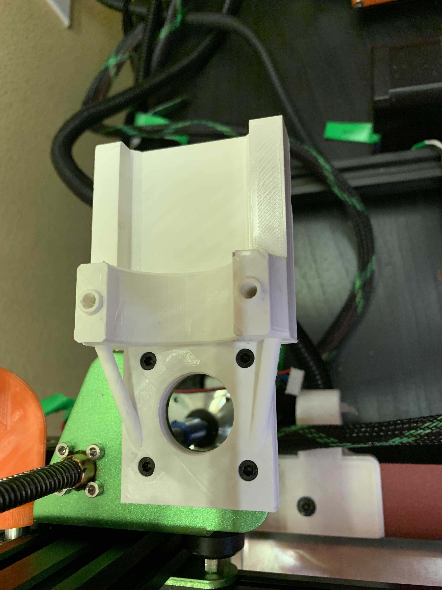
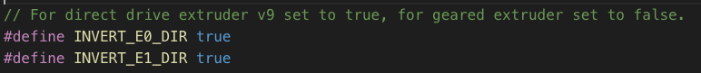
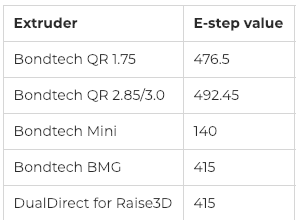
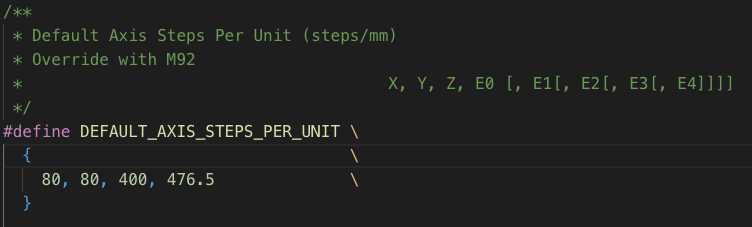

# Install a Bondtech QR Extruder on a Tevo Tornado

My goal is to replace the Titan (Tevo Edition) that came with my Tevo Tornado, but this should generally work for any Titan extruder (e.g. E3D).

## Custom Boden Mount

I designed the mount in TinkerCad to be able to fit the old Titan base/holes to fit a [Bondtech QR](https://www.bondtech.se/en/product/qr/) as boden mount (not direct drive).

[Here](https://www.thingiverse.com/thing:3318641) is the Thingiverse link if you want to download the STL.

[Here](https://www.tinkercad.com/things/4fFxBvBL0lB) is the Tinkercad link if you want to contribute/modify. 

## Boden Tube Setup

I did [purchase](https://www.matterhackers.com/store/l/e3d-groove-mount-bowden-adapter-1.75mm/sk/MQTFE8VW) these nice machined boden tube adapter from E3D to fit like a direct drive into my E3D V6 Hotend.  

## Change E-Steps

Change the steps for the extruder - you may do further calibration if you desire.  Choose from option below.

**Ensure you reverse direction!**

### Option 1: E-Steps

Based on the chart provided from Bondtech

Run the [gcode](QR1.75.gcode) (or the following steps)

1. M92 E-476.5 ; Change e-steps for new Extruder
1. M500 ; Save config

**IMPORTANT** Check your drive direction - Use M92 to change axis steps to negative value

## Option 2: Marlin Firmware Settings (Preferred Method)

1. Open your firmware - I have [a few options](../Firmware/) if you want to start from.
1. Change setting based on chart (476.5)

1. Flash your firmware with the new EStep settings.  Instructions on how to do that [here](http://www.instructables.com/id/Flashing-a-Bootloader-to-the-CR-10/).

## References

* [BMG Mount for Tevo Tornado](https://www.bondtech.se/en/product/tevo-tornado-kit/)
* [Creality CR-10 Install Guide](https://www.bondtech.se/wp-content/uploads/2018/08/Bondtech-Creality-CR-10-Installation-Guide-V1.0.pdf)
* [Invert Drive Direction via GCODE](https://3dprinting.stackexchange.com/questions/4381/is-there-a-way-to-invert-motor-direction-with-gcode-instead-of-firmware-in-marli)