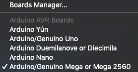
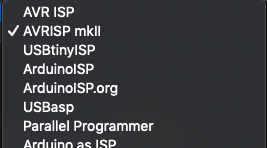
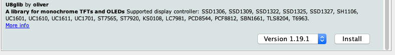

# General Guides

## Flashing Firmware

1. [Download](https://www.arduino.cc/en/Main/Software) Arduino IDE software
1. Open Marlin.ino from the [firmware](../Firmware) of your choice or find your own
1. Edit anything in the Configuration.h via the open tabs - save file.
1. Configuire Ardino:
    1. Select Board: In the IDE, goto Tools -> Board - > Select "Arduino/Genuino Mega or Mega 2560"
    
    1. Select Processor: In the IDE, goto Tools -> Processor -> "ATmega2560 (Meaga 2560)"
    
    1. Select Programmer: In the IDE, goto Tools -> Programmer -> "AVRISP mkII" 
    
    1. Connect to printer via USB and ensure you have FTDI Drivers installed to do this.
    1. Add required library - u8glib - add via Library Manager if you don't have it
    
1. Verify code
1. Upload firmware, wait for reboot and print away!

### References

* [ruiraptor guide](https://www.youtube.com/watch?v=g4aHmbt5gMA)
* [FTDI Drivers](https://www.ftdichip.com/Drivers/D2XX.htm)